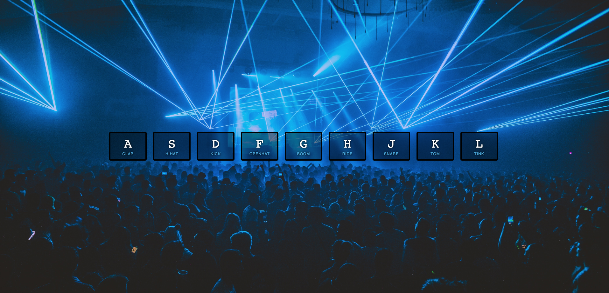

# Drum Kit :drum:

A basic JavaScript drum kit  

 

Based on Lesson 01 from the <em>JavaScript 30</em> course by Wes Bos. 
https://javascript30.com/

Practice with:

- key events
- playing audio
- listening for 'transitionend' event
